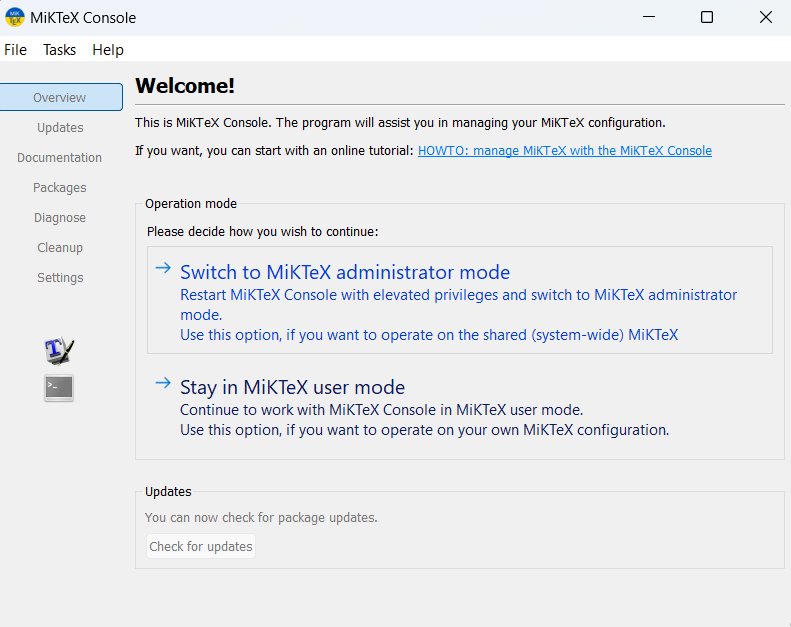
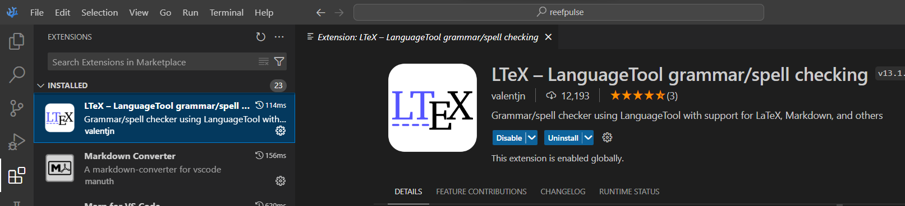
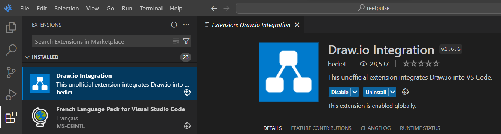
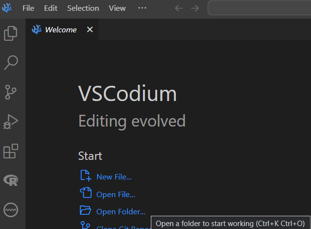
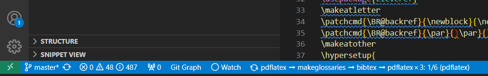
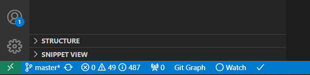
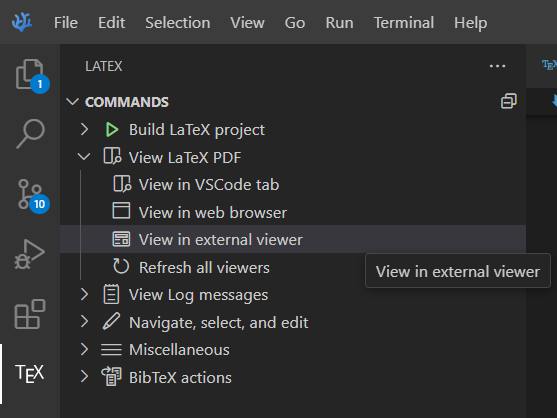

# Setup latex to be used on VSCodium

1. Download and install https://strawberryperl.com/
2. Download and install https://miktex.org/download

    2.1. Open Miktex

    2.2. Switch to the administrator mode
    
    2.3 Click on the button to check for package updates.
3. Download and install https://github.com/James-Yu/LaTeX-Workshop
4. Download and install https://www.sumatrapdfreader.org/download-free-pdf-viewer
5. Download and install https://github.com/VSCodium/vscodium/releases
6. In VSCodium install the extension `LTeX` https://marketplace.visualstudio.com/items?itemName=valentjn.vscode-ltex for spell checking as depicted below:

7. In VSCodium install the extension `Draw.io` Integration by hediet for handling graphs as depicted below:

8. In a Windows PowerShell type

`mkdir C:\git`

9. In a Windows PowerShell type

`cd C:\git`

10. In a Windows PowerShell type (you should have git installed)

`git clone https://github.com/ybayle/write.git`

11. In VSCodium, open the folder `write` using the shortcut `CTRL+K+O` (as in Oscar not zero0) as depicted below:

12. In VSCodium, open the file `C:/git/write/RapportDeStage/main.tex`.
13. In VSCodium, click on the `TEX` box in the left panel and then on the first recipe `pdflatex ➞ makeglossaries ➞ bibtex ➞ pdflatex × 3` as depicted in the image below:

If you have multiple files opened, you need to be on the `.tex` file (select it) to be able to compile Latex. Otherwise, it won't work.

14. On the bottom of your window you should see the compiling in progress:

The first time you compile a latex file, it will take some time to download and install all the packages.
Once done a check is displayed.

15. Click on `View in external viewer` to open the PDF in Sumatra.

You can also open it in a new tab in VSCodium or in Firefox.

16. Check that the PDF generated is similar to the one displayed here: https://github.com/ybayle/write/blob/master/RapportDeStage/main.pdf

17. Read https://www.overleaf.com/learn/latex/Tutorials#Learn_LaTeX_in_30_minutes

18. You can now code in Latex from VSCodium
